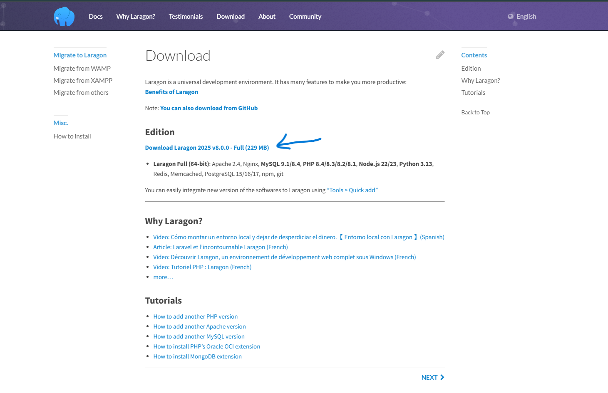
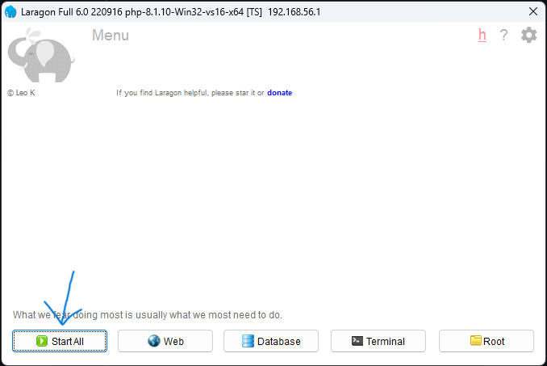
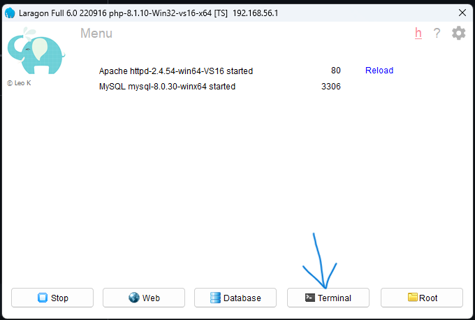
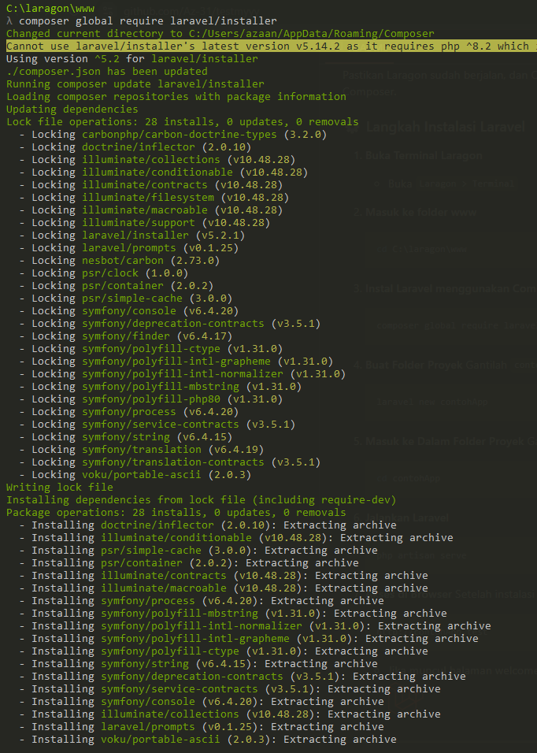
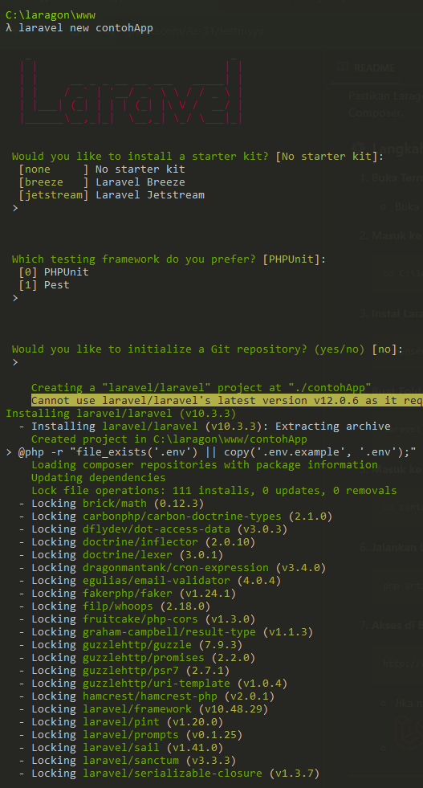
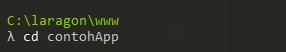
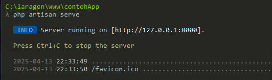

# Panduan Instalasi Laragon & Laravel

Dokumentasi ini menjelaskan cara menginstal **Laragon** sebagai local development environment, serta bagaimana cara menginstal **Laravel** di dalamnya.

---

## Instalasi Laragon

### Langkah Instalasi

1. **Download Laragon**
   - Kunjungi [https://laragon.org/download](https://laragon.org/download)
   - Pilih versi **Full** untuk kebutuhan PHP, Apache, MySQL, dan Laravel
   - 
   
2. **Instalasi**
   - Jalankan installer dan ikuti petunjuknya
   - Contoh direktori instalasi: `C:\laragon`
   - Klik **Next** hingga selesai

3. **Menjalankan Laragon**
   - Buka Laragon
   - Klik tombol **Start All** untuk menjalankan Apache dan MySQL
   - 

4. **Cek di Browser**
   - Buka `http://localhost` di browser
   - Jika muncul halaman Laragon, maka instalasi berhasil
   - 

---

## 🌐 Instalasi Laravel di Laragon

### 📌 Persiapan

Pastikan Laragon sudah berjalan, dan Composer sudah terinstal. Versi Full Laragon biasanya sudah menyertakan Composer.

### ⚙️ Langkah Instalasi Laravel

1. **Buka Terminal Laragon**
   - Buka `Laragon > Terminal`
   - 

2. **Masuk ke folder www**
   ```bash
   cd C:\laragon\www
   ```

3. **Instal Laravel menggunakan Composer**
   ```bash
   composer global require laravel/installer
   ```
   
   
4. **Buat Folder Proyek**
   Gantilah `contohApp` dengan nama folder proyek kamu:
   ```bash
   laravel new contohApp
   ```
   

5. **Masuk ke Dalam Folder Proyek**
   Gantilah `contohApp` dengan nama folder proyek kamu:
   ```bash
   cd contohApp
   ```
   

6. **Jalankan Laravel**
   ```bash
   php artisan serve
   ```
   
   
7. **Akses di Browser**
   Setelah instalasi selesai, buka:
   ```
   http://contohApp.test
   ```
   - Jika muncul halaman welcome Laravel, berarti berhasil 🎉
   - 

---

## 📌 Referensi

- [Laragon Official Site](https://laragon.org)
- [Laravel Official Docs](https://laravel.com/docs)

---
